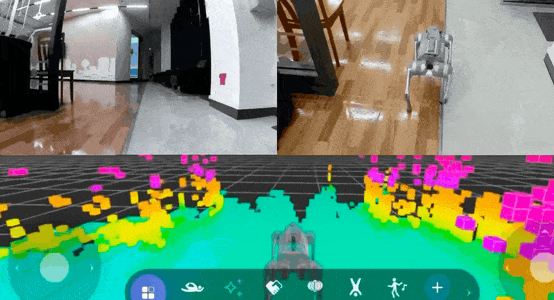
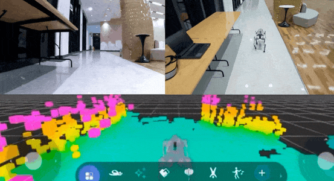
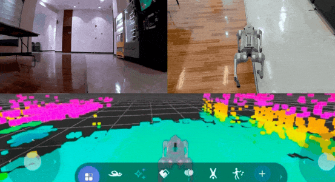
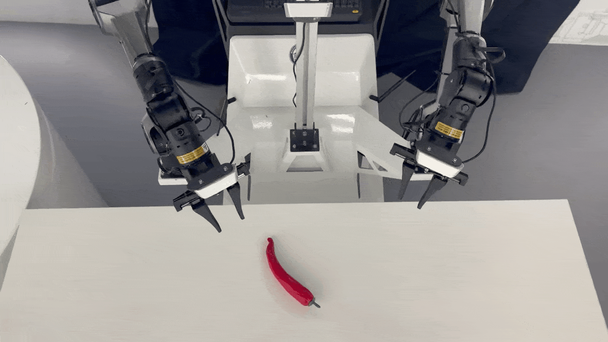
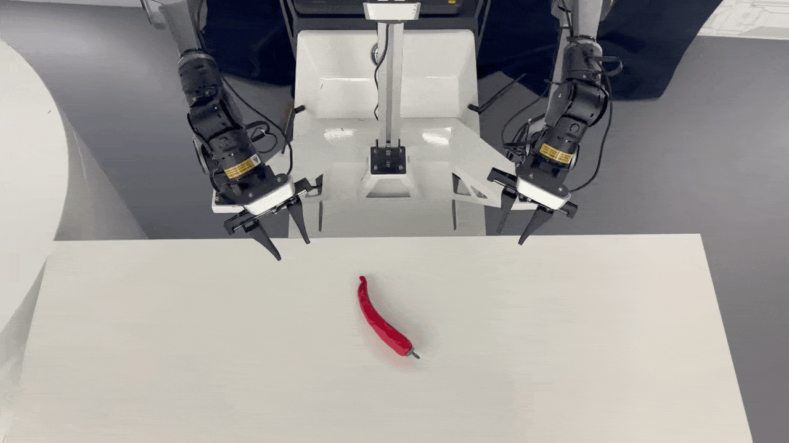
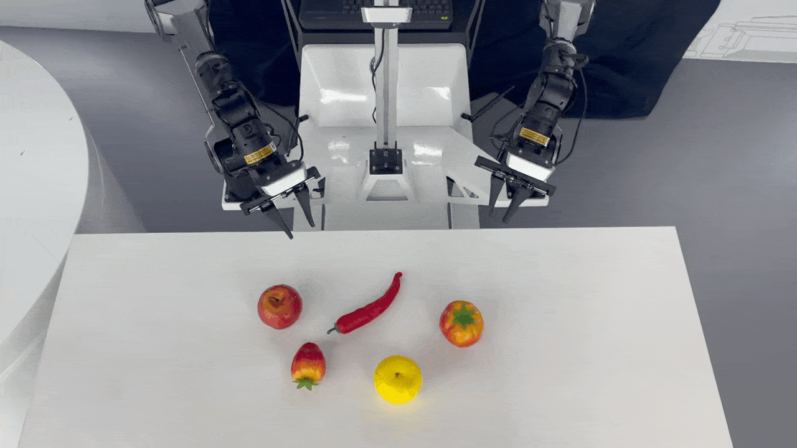

# 🧠 CVM: Covariance Volume Maximization for Embodied Latent Exploration in Deep Reinforcement Learning

<p align="center">
  <b>Coverage-driven latent exploration via exact covariance log-volume gain</b><br/>
  Stable behavioral representation + D-optimal exploration bonus for embodied RL
</p>

<p align="center">
  <!-- Anonymous-friendly badges (no org/user names) -->
  
  
  
  
</p>

---

## 📌 Overview

Efficient exploration remains a key challenge in deep reinforcement learning, especially for embodied agents operating in realistic environments with high-dimensional observations and complex dynamics.

**Covariance Volume Maximization (CVM)** is a coverage-driven latent exploration framework designed to address these challenges. It introduces two key components:

1. **🧩 Behavioral State Encoder (policy-mixture training)**  
   Learned using a **policy-mixture objective** to reduce representation drift under rapidly changing exploration policies. This yields stable and behaviorally meaningful latent displacements, filtering out nuisance visual variations.

2. **📈 CVM Exploration Bonus (exact log-det gain)**  
   Rewards each transition by its **exact increase** in the **log-determinant of the covariance** of recent latent displacements. This explicitly expands the explored region (**covariance volume**) and prioritizes under-covered directions, aligning with the classical **D-optimal design** criterion for information efficiency.

> **Intuition:** Instead of locally “spanning directions” that can be redundant or unreachable under embodiment constraints, CVM directly drives **global coverage expansion** in a statistically principled way.

---

## 🧪 Experimental Results

### 🎥 Demos in Go2 Environment

| Easy | Medium | Hard |
| :---: | :---: | :---: |
|  |  |  |

### 🤖 Demos on Robotic

| Performance 1 | Performance 2 | Performance 3 |
| :---: | :---: | :---: |
|  |  |  |

We evaluate CVM across realistic embodied environments, specifically assessing exploration efficiency, robustness, and scalability in navigation tasks.

---

## 🌍 Environments

Experiments are conducted using the **Unitree Go2 quadruped robot** in realistic indoor environments (Habitat):

- **(a) 1F6R-easy**: 1 Floor, 6 Rooms  
- **(b) 1F9R-medium**: 1 Floor, 9 Rooms  
- **(c) 2F18R-hard**: 2 Floors, 18 Rooms  

---

## 🆚 Baselines

We compare CVM against a wide range of exploration baselines:

- **Bonus-based**: RND (Burda et al., 2018), E3B (Henaff et al., 2022)  
- **Latent/Dynamics-based**: RIDE (Raileanu et al., 2020), EME (Wang et al., 2024)  
- **Randomized/Directional**: RLE (Mahankali et al., 2024), METRA (Park et al., 2023), HILP (Park et al., 2024)

CVM demonstrates substantial improvements in exploration efficiency and robustness compared to these methods.

---

## 🗂️ Code Structure

```text
src/habitat-lab/
  cvm/
    agent.py        # CVM Agent (Actor-Critic + Encoder)
    cvm_lib.py      # CVM Estimator (Covariance update & Bonus calculation)
    buffer.py       # Replay buffer implementation
  cvm_train.py      # Main training script for Habitat environments
```

---

## ⚙️ Installation & Usage

### ✅ 1. Dependencies

Follow the installation guide for **Habitat Lab**:  
https://github.com/facebookresearch/habitat-lab

Then install Python requirements:

```bash
cd src/habitat-lab
pip install -r requirements.txt
```

> Tip: Using a clean environment (e.g., conda) helps avoid dependency conflicts.

---

### 📦 2. Download Assets

Download the necessary Habitat test scenes and datasets:

```bash
python -m habitat_sim.utils.datasets_download --uids habitat_test_scenes --data-path data/
python -m habitat_sim.utils.datasets_download --uids habitat_test_pointnav_dataset --data-path data/
```

---

### 🚀 3. Training

To run the CVM agent on a Habitat scene:

```bash
cd src/habitat-lab
python cvm_train.py --scene /path/to/scene.glb --cvm_coef 0.1
```

**Arguments**
- `--scene`: Path to the GLB scene file  
- `--cvm_coef`: Coefficient for the CVM exploration bonus (default: `0.1`)  

---

## 🧾 Reproducibility Notes (Anonymous-friendly)

For consistent results during anonymous review, we recommend:
- Fixing random seeds (Python / NumPy / PyTorch)
- Logging: episode return, success rate, bonus magnitude, and covariance log-det trajectory
- Reporting mean ± std over ≥3 seeds

---

## ❓ FAQ

**Q1: Why log-det covariance (volume) instead of directional spanning?**  
Directional spanning can over-sample redundant or unreachable directions under embodiment constraints. CVM directly measures **global coverage expansion** through covariance volume, prioritizing under-covered directions in a principled, **D-optimal** manner.

**Q2: Does CVM require task rewards?**  
CVM is an exploration bonus and can be combined with standard RL objectives; it is designed to be plug-and-play with actor-critic training.

**Q3: What is the role of the behavioral encoder?**  
It stabilizes the latent space under changing policies, reducing drift and making displacement-based statistics (covariance, log-det gain) reliable.

---

## 📎 Citation

If you find our work useful, please cite:

```bibtex
@inproceedings{anonymous2026cvm,
  title={Covariance Volume Maximization for Embodied Latent Exploration in Deep Reinforcement Learning},
  author={Anonymous},
  booktitle={Proceedings of the Anonymous Conference},
  year={2026}
}
```
